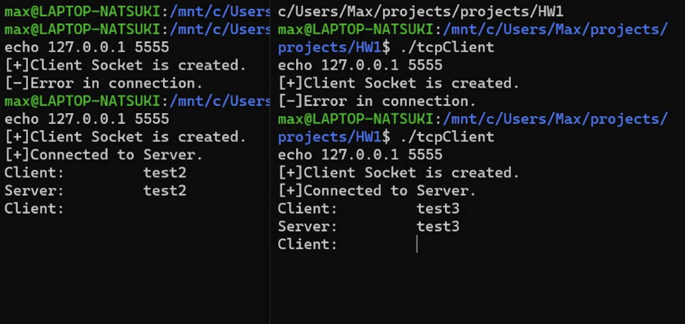
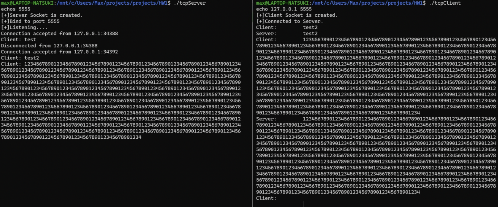
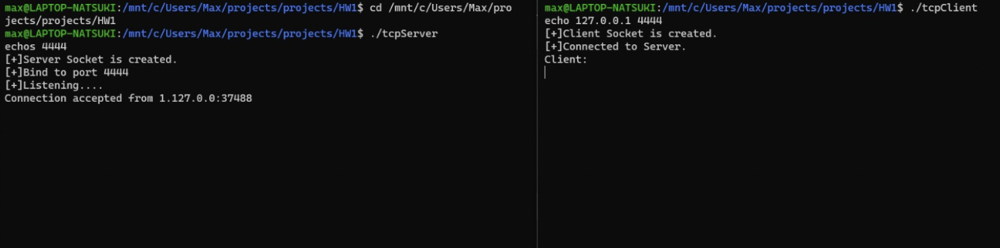
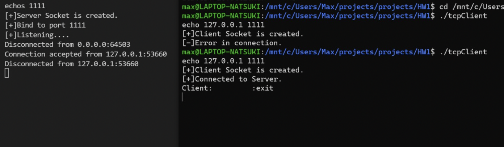
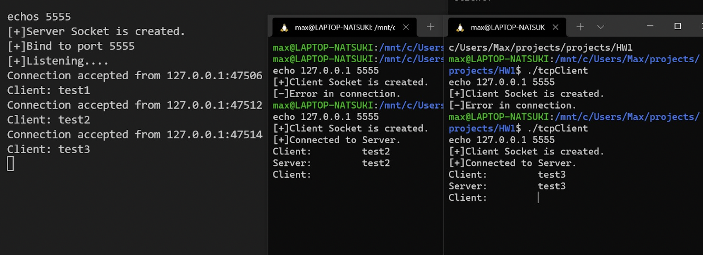

# TCP-Client-Server-in-C++

## Purpose:

This Project is developed as a part of Machine Problem 1 of Computer Networks and Communication course. It is performed as a team of two where we are supposed to implement a client and server for a simple TCP echo service.

---
## Implementation:

 The Client Server model performs the following implementation:
1.  Start the server first with the command line: echos Port, where Port is the port number on which the server is listening. The server supports multiple simultaneous connections.
2.  Start the client second with a command line: echo IPAdr Port, where IPAdris the IPv4 address of the server and Portis the port number on which the server is listening.
3.  The client reads a line of text from its standard input and sends the same signal back to the server.
4.  The server reads the line from its network input and echoes the line back to the client.
5.  The client reads the echoed line and prints it on its standard input.
6.  When the client reads an EOF from its standard input i.e. “: exit”, it closes the socket and exits. When the client closes the socket, the server receive a TCP FIN packet, and the server child process’ read() command returns with a 0, after which the child process exits.

---
## Usage
In the Server Client application multiple clients can be connected to the server. Each time a server accepts a client connection it shows a message with the client information. When a client sends a message to the server, it receives it and sends it back to the client which is again printed in the client console. On the client, just type in a message and hit enter to send it to the server.

---

## Running

### Installation: 

Clone this repository
```
git@github.tamu.edu:baruah-dharmendra/ECEN602_Team04.git
```

### Building: 

For this we will need standard C++ compiler installed in the machine in which the program is run. To build it can be directly done from the make file or individually by compiling the server client.

For building without the make file:

Build the client: ``` g++ -o client tcpClient.cpp ```

Build the server: ``` g++ -o server tcpServer.cpp ```

### Execution:

In the first terminal run:     ``` ./server ```

In another terminal run:     ``` ./client ```

After execution to start the server type:  
echos Port(ex. 4444)
 
```echos 4444```

If the server response following should be visible in the terminal.
```
[+]Server Socket is created.

[+]Bind to port Port(ex. 4444)

[+]Listening....
```
In client terminal, we can start the client by:
echo IPAdr(ex. 127.0.0.1) Port(ex. 4444)

```echo 127.0.0.1 4444```

The client should respond to it with the following message:
```
[+]Client Socket is created.

[+]Connected to Server.

Client:
```
Once the connection to the client is established the server should show the following message:

```
Connection accepted from 127.0.0.1:47506
```
### Testing:

To test it, if at the client terminal, following input is enter:

```
Client: test1 
``` 

Then, the message will be echoed back by the server and following message should be displayed in the client side.

```
Client: test1
Server: test1
```

Whereas, the server terminal should display the client message as follows to acknoledge read and write at the servers end.
```
Client: test1
```

### Exiting:

For closing the client `:exit` command is used as EOF.

Following should appear at the client and the server side.

Client terminal:

```
Disconnected from server.
```
Server terminal:

```
Disconnected from 127.0.0.1:47506
```
---

## Test cases


Testcase 1:

Line of text terminated by a newline



Testcase 2:

Line of text the maximum line length without a newline



Testcase 3:

Line with no characters and EOF



Testcase 4:

Client terminated after entering text



Testcase 5:

Three clients connected to the server



---
## Team

@dharmendrabaruah
@yehtungchi

---
## Effort

The entire project was completed with equal efforts from either member of the team maintaining synergy. It was carried out in the university library, where both of the members were responsible for the analysis, coding, debugging, testing and documentation of the server client application.

---
